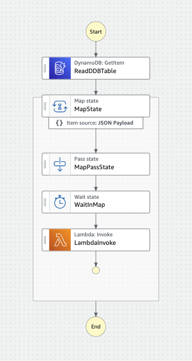
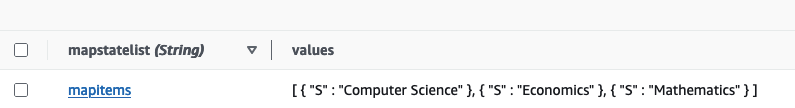
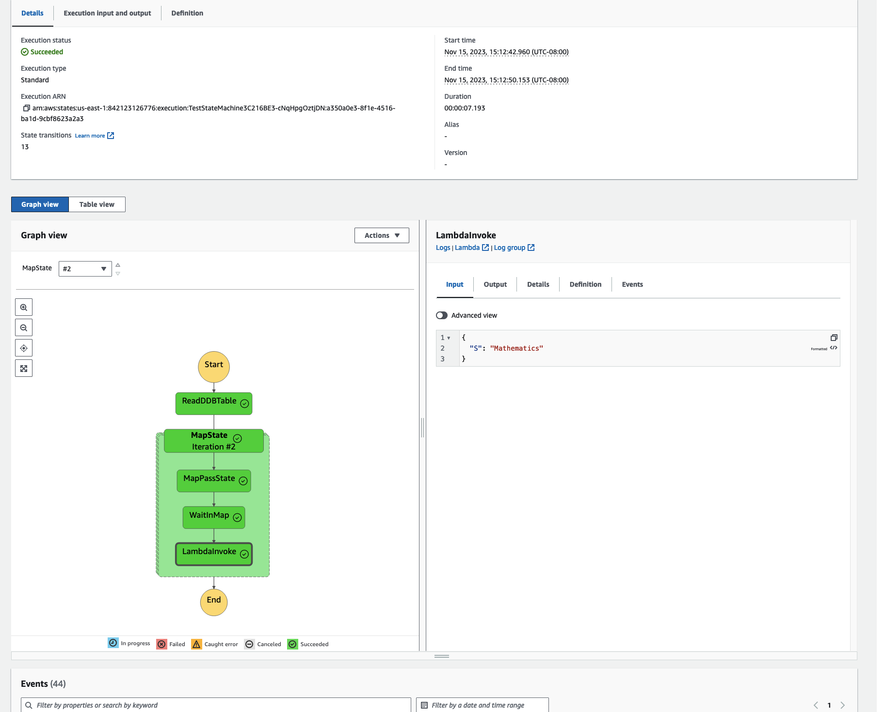
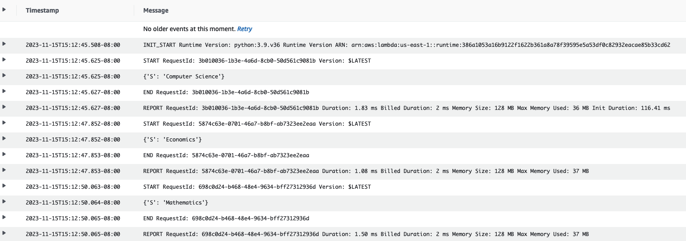

# AWS Step Functions & Distributed Parallel Processing

This project shows how to use the [`Map`](https://docs.aws.amazon.com/step-functions/latest/dg/amazon-states-language-map-state.html) state for [AWS Step Functions](https://aws.amazon.com/step-functions/) to process data in parallel workflows. The project uses AWS CDK for deploying the infrastructure. Please edit the [`config.json`](./config.json) file to configure the resources as required.

## Overview

This project creates an AWS Step Functions state machine that will read a list of items from a DynamoDB table, and then pass it to the `Map` state of the statemachine. The `Map` state processes the items from the list in parallel. For this project for every item, a virtually empty [Lambda Function](./src/handler.py) is invoked. The function simply logs the value passed to it.

### Source Code Overview

The resources deployed in this project are in the file [`lib/stpfnc-stack.ts`](./lib/stpfnc-stack.ts). The stack creates a DynamoDB table, a Lambda function, and a State Machine. The state machine reads from the DynamoDB table, gets a list of items, and invokes the Lambda function for each of the items. 

The `utils` folder has the [`load-ddb.py`](./utils/load-ddb.py) file to load the created DynamoDB table with sample list of items. The folder has two sample JSON files with list of items that you can use to load the table, and test the state machine's map state.


### State Machine Diagram

This is the state machine created by this project.



### Prerequisites

1. An [AWS Account](https://signin.aws.amazon.com/signin?redirect_uri=https%3A%2F%2Fportal.aws.amazon.com%2Fbilling%2Fsignup%2Fresume&client_id=signup)
2. [AWS CDK](https://aws.amazon.com/cdk/) installed and setup. Please note AWS CDK is constantly improved with new versions released frequently. This project is deployed and tested with AWS CDK Version 2.92.0. 

## Stack Deployment, Testing & Removal

Please note that this stack is likely to incur cost (it is not free!). Remeber to destroy the stack as shown below. You should be familiar with use `cdk` commands and ensure that the region you are using is `cdk` bootstrapped.

### Deploy

To install, clone the respository and deploy using default AWS credentials:

```bash
cdk deploy 
```
If you prefer to specify your AWS profile for the account/region:

```bash
cdk deploy --profile <your profile name here>
```
A successful deployment will result in the State Machine ARN and Name being printed to the console (it will have the AWS Account Number and Region specific to your deployment:

```bash
Outputs:
StpfncStack.StateMachineArn = arn:aws:states:us-east-1:xx22yy12zz76:stateMachine:TestStateMachine3C216BE3-cNqHpgOztjDN
StpfncStack.StateMachineName = TestStateMachine3C216BE3-cNqHpgOztjDN
Stack ARN:
arn:aws:cloudformation:us-east-1:xx22yy12zz7:stack/StpfncStack/47730ab0-8353-11ee-995c-0aa42affc2ab
```

### Test
1. Once the stack is created, before starting the State Machine execution, you will need to load the list of items in the DynamoDB table. The project provides sample data and Python script to load in the DynamoDB table. There two sample lists: [`simplelist.json`](./utils/simplelist.json) and [`listofdicts.json`](./utils/listofdicts.json). The first is simple list of three subjects - Computer Science, Economics, and Mathematics. The second list is a list of dictionaries, each dictionary has the `topic` and `name` keys. 

```bash
cd utils
python load-ddb.py --config ../config.json --profile <your-aws-profile> --json simplelist.json
```
The command above loads the simple list into the DynamoDB table. When you explore items in the DDB table, here is what the loaded simple list looks like:



2. You can start the execution of the state machine from the Step Functions console or the command line. Here is how to start an execution from the command line (using the State Machine ARN from the output of the `cdk deploy`):

```bash
aws stepfunctions start-execution --state-machine-arn arn:aws:states:us-east-1:xx22yy12zz76:stateMachine:TestStateMachine3C216BE3-cNqHpgOztjDN --input {} --profile <your-aws-profile>

```
The command above will return (NOT wait for execution to finish) with an `executionArn`.
3. You can either use the `executionArn` to use the `describe-execution` to get the status of the State Machine execution. Or you can use the console. Here is what you would see on successful execution:

Here is a screenshot from the console of a successful run - it shows the Graph view plus details on the LambdaInvoke section - since it was selected prior to taking the screenshot:



4. On the right hand side you can see the `Input` to the `LambdaInvoke` step, and if you go click on the `Log group` - you can see the output of the event passed to the Lambda function:



You can see that the Lambda function was invoked three separate times - once for each of the 3 items in the list.
Take a look at the timestamps of each invocation - what do you notice? They are about 2 seconds apart. This is because the State Machine as a Wait State of 2 seconds, and a Concurrency of 1 (see default values in `config.json`). The invocations are 2 seconds apart because given single concurrency the State Machine invokes Lambda one at a time, and the Map state has 2 second wait. The state machine goes through the Map state and then invokes the Lambda second and third time 2 seconds apart.


### Further Learning

1. Set the `maxConcurrency` in the `config.json` to 3 or higher. Deploy the stack again to change the configuration of the State Machine. Execute and observe results. With the concurrency 3 or higher - the Lambda function will be invoked 3 times almost at the same time in parallel (you can see it in the `timestamps` of the log or the timing in the `Events` console below `Graph view`).

2. Try loading the DDB table with the `listofdicts.json`. Run the state machine. And observe the items that get passed to the Lambda function. You will observe a DynanmoDB `M` passed with the individual key-value pairs passed along. 

3. Increase the `waitDurationSeconds` to 25 seconds, with the `timeoutDurationSeconds` to be at 20. Deploy the stack again to update the configuration. Now when you run the state machine - it should fail due to a timeout.


### Destroy

After you are done, to destroy the stack:

```bash
cdk destroy
```
### General Notes:

- Dynamo DB table has a removal policy of `DESTROY` applied since this is for learning/testing. If you intend to use this code for production please change the removal policy for resources as needed.

### Resources
